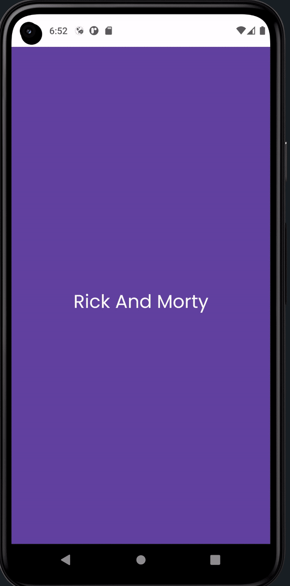
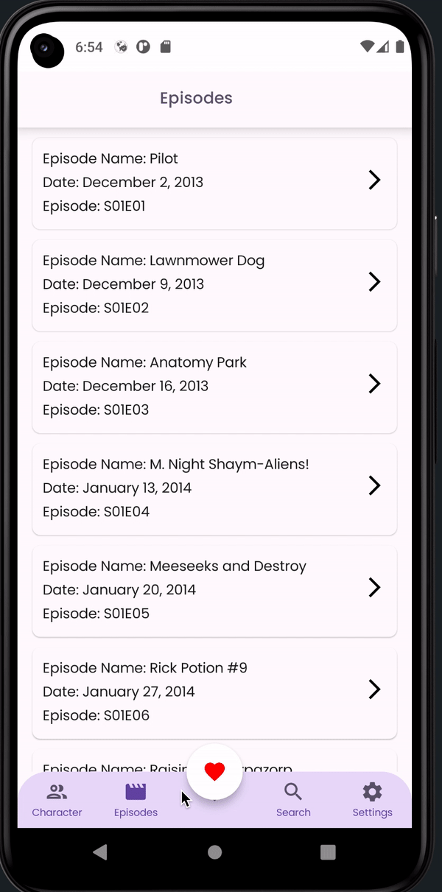
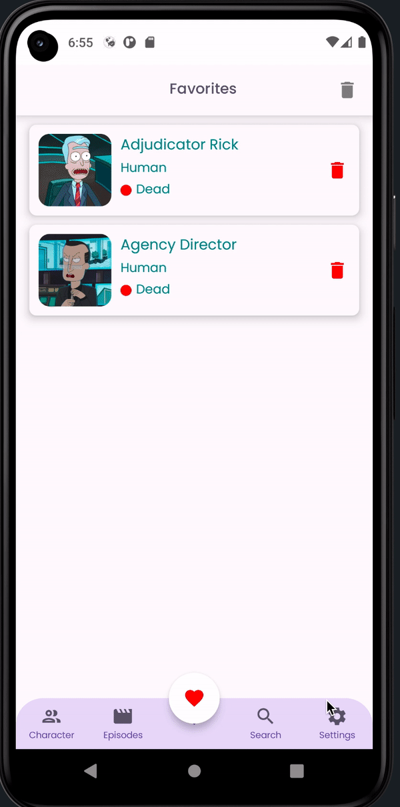
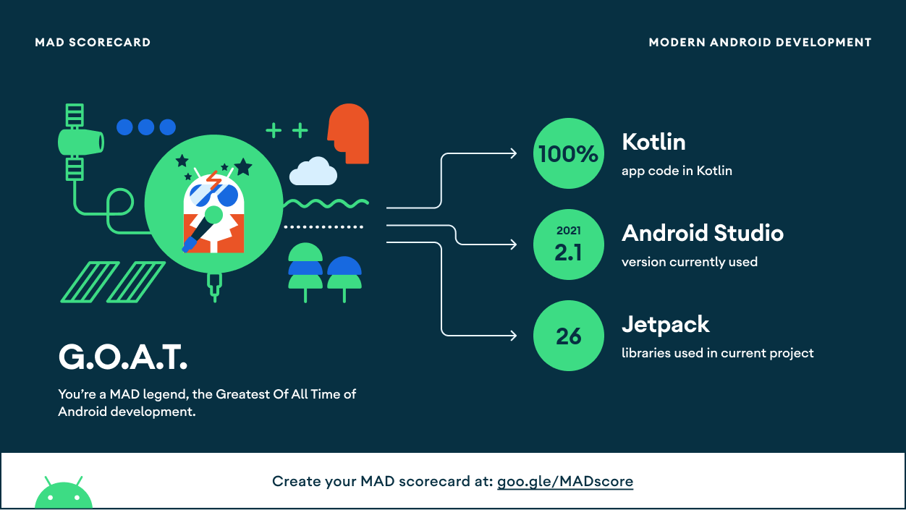
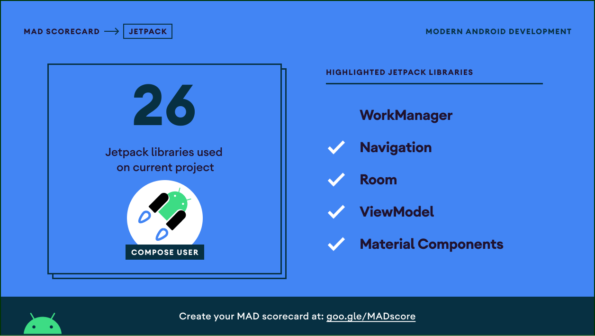

<br />
  <a href="https://github.com/othneildrew/Best-README-Template">
  <h1 align="center">Rick And Morty Jetpack Compose Sample App</h1>
  
  [](https://opensource.org/licenses/Apache-2.0)
  
  [](https://developer.android.com/jetpack/compose)
  [](http://kotlinlang.org)
  [](https://lv.binarybabel.org/catalog/gradle/latest)

  
<p align="center">
 
  
  
  

</p>
  
  <p align="center">
</p>

<!-- TABLE OF CONTENTS -->
## Table of Contents

* [About the Project](#about-the-project)
  * [Architecture](#architecture)
* [Features](#features)
* [Environment Setup](#requirements)
* [Contact](#contact)

  <!-- ABOUT THE PROJECT -->
## About The Project
  
This Sample Application was developed by using Jetpack Compose. MVVM architecture and best practice are followed. You can find everything you need in the Jetpack Compose project within the application.  

  ## Architecture
MVVM (Model-View-ViewModel) architecture pattern has been used in the development of this application. The development language of the application is Kotlin.

* Architecture;
    * [ViewModel](https://developer.android.com/topic/libraries/architecture/viewmodel)
    * [Hilt](https://developer.android.com/training/dependency-injection/hilt-android) 
    * [Navigation](https://developer.android.com/guide/navigation)
    * [DataStore](https://developer.android.com/topic/libraries/architecture/datastore)

## Tech Stacks
This project uses many of the popular libraries, plugins and tools of the android ecosystem.
 
- [Compose](https://developer.android.com/jetpack/compose)
  
    - [Material](https://developer.android.com/jetpack/androidx/releases/compose-material) - Build Jetpack Compose UIs with ready to use Material Design Components.
    - [Foundation](https://developer.android.com/jetpack/androidx/releases/compose-foundation) - Write Jetpack Compose applications with ready to use building blocks and extend foundation to build your own design system pieces.
    - [UI](https://developer.android.com/jetpack/androidx/releases/compose-ui) - Fundamental components of compose UI needed to interact with the device, including layout, drawing, and input.
    - [ConstraintLayout](https://developer.android.com/jetpack/androidx/releases/constraintlayout) - ConstraintLayout-compose 1.0 provides ConstraintLayout functionalities in Jetpack Compose.
    - [Lifecycle-ViewModel](https://developer.android.com/jetpack/androidx/releases/lifecycle) - Perform actions in response to a change in the lifecycle status of another component, such as activities and fragments.
    - [Paging](https://developer.android.com/topic/libraries/architecture/paging/v3-overview) - The Paging Library makes it easier for you to load data gradually and gracefully within your app's [RecyclerView](https://developer.android.com/reference/androidx/recyclerview/widget/RecyclerView).
    - [Lottie](https://github.com/airbnb/lottie/blob/master/android-compose.md) - Lottie is a mobile library for Android and iOS that parses Adobe After Effects animations exported as json with Bodymovin and renders them natively on mobile!
    - [Coil](https://coil-kt.github.io/coil/compose/) - An image loading library for Android backed by Kotlin Coroutines.

- [Accompanist](https://google.github.io/accompanist)
  
    - [Insets](https://google.github.io/accompanist/insets/) - Insets for Jetpack Compose takes a lot of the ideas which drove Insetter for views, and applies them for use in composables.
    - [Placeholder](https://google.github.io/accompanist/placeholder/) - A library which provides a modifier for display 'placeholder' UI while content is loading.

  
- [Jetpack](https://developer.android.com/jetpack)
  
    - [AndroidX](https://developer.android.com/jetpack/androidx) - Major improvement to the original Android [Support Library](https://developer.android.com/topic/libraries/support-library/index), which is no longer maintained.
    - [Lifecycle](https://developer.android.com/topic/libraries/architecture/lifecycle) - Perform actions in response to a change in the lifecycle status of another component, such as activities and fragments.
    - [ViewModel](https://developer.android.com/topic/libraries/architecture/viewmodel) - Designed to store and manage UI-related data in a lifecycle conscious way. The ViewModel class allows data to survive configuration changes such as screen rotations.
    - [Room](https://developer.android.com/training/data-storage/room) - Provides an abstraction layer over SQLite used for offline data caching.
    - [Paging3](https://developer.android.com/topic/libraries/architecture/paging/v3-overview) - The Paging Library makes it easier for you to load data gradually and gracefully within your app's [RecyclerView](https://developer.android.com/reference/androidx/recyclerview/widget/RecyclerView).
    
- Others
- [Retrofit](https://square.github.io/retrofit/)
- [OkHttp-Logging-Interceptor](https://github.com/square/okhttp/blob/master/okhttp-logging-interceptor/README.md) - Logs HTTP request and response data.
- [Coroutines](https://github.com/Kotlin/kotlinx.coroutines) - Library Support for coroutines.
- [Flow](https://developer.android.com/kotlin/flow) - Flows are built on top of coroutines and can provide multiple values.
- [Material Design](https://material.io/develop/android/docs/getting-started/) - Build awesome beautiful UIs.
- [Coroutines](https://github.com/Kotlin/kotlinx.coroutines) - Library Support for coroutines,provides runBlocking coroutine builder used in tests.
- [Gson](https://github.com/google/gson) - A modern JSON library for Kotlin and Java.
  
## Features
  - Users can save their own favorite characters.
  - The users can view all characters' informations; such as names, statuses, etc.
  - The users can view selected characters' details such as alive or dead, species, genders, last know locations. On the detail page, the users can add or remove the characters to their favorites.
  - The users can search characters by name and filter by status and gender.
  - The users can change application theme.
  
## 🏆 MAD Scores




  

## 👩‍💻 Contribution

All contributions are welcomed. Feel free to open PR. If you've found an error in this sample, please file an issue:</br>
<https://github.com/mertcantoptas/BaseApp-Jetpack-Compose-Android-Kotlin/issues>
</br>
PRs are encouraged.
  

## Environment Setup
  - First, make sure you have Android ```Bumblebee (2021.1.1)```  version installed
  - Android Studio's Gradle JDK version should be Java 11.0.10.
  
    
<!-- CONTACT -->
## Contact

- [Linkedin](https://www.linkedin.com/in/mertcantoptas/)
- [Twitter](https://twitter.com/Merttoptas)
- [Medium](https://medium.com/@merttoptas34)
- [Personal Web Site](https://merttoptas.com)

```xml
Designed and developed by merttoptas (Mert Toptas)

Licensed under the Apache License, Version 2.0 (the "License");
you may not use this file except in compliance with the License.
You may obtain a copy of the License at

   http://www.apache.org/licenses/LICENSE-2.0

Unless required by applicable law or agreed to in writing, software
distributed under the License is distributed on an "AS IS" BASIS,
WITHOUT WARRANTIES OR CONDITIONS OF ANY KIND, either express or implied.
See the License for the specific language governing permissions and
limitations under the License.
